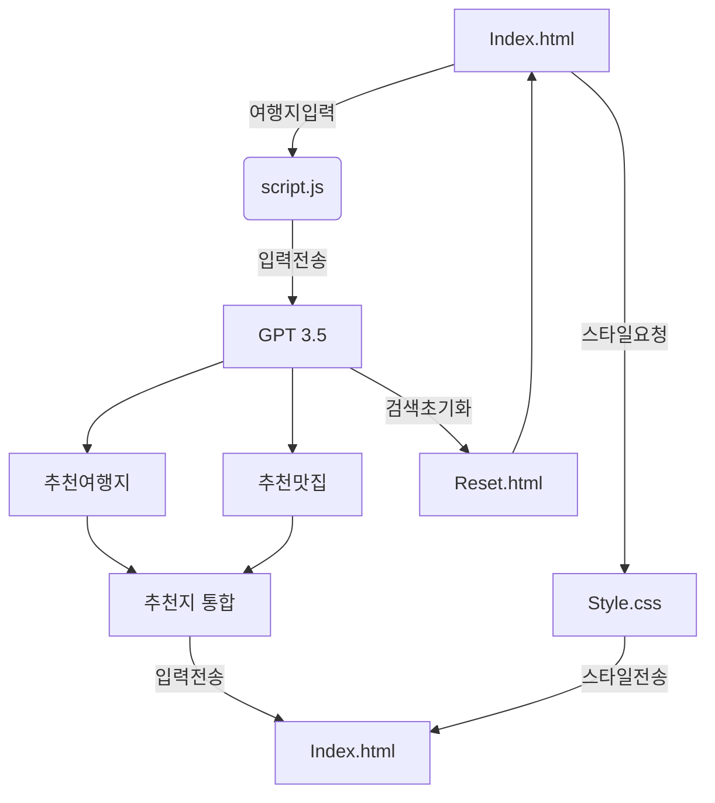
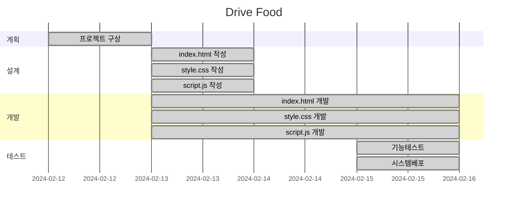

# Drive Food Project


## 목표
- 어디로 여행갈지 정해지지 않고 자유여행을 고민할때 시간감소
- 여행에 대한 고민없이 근처 맛집탐방 및 여행

## 기능

- **드라이브 추천**: GPT-3.5를 통해 입력한 장소의 드라이브 코스 및 관광지, 야경을 추천 받습니다
- **근처 맛집 추천**: 드라이브 코스 근처 맛집을 추천 받습니다.

## 추가기능

- 로그인
- 회원가입
- 아이디 / 비번찾기
- 개인 여행지 등록

## 사용방법
 - Drive Food를 활성화 해주세요.
 - 가고 싶은 여행장소를 입력하시면 OPENAI가 근처 드라이브 코스와 관광지를 가르쳐 줍니다.
 - 추가하고 싶은 장소를 입력해 주시면 같이 검색해 줍니다.

* 서비스 URL 정보
    * 실행 URL: https://junha9694.github.io/GPT_-travel_repoProject1
    * https://github.com/Junha9694/GPT_-travel_repoProject1
    

## 구조


## WBS



## URL 구조
- main

| App       | URL                                        | Views Function    | HTML File Name                        | Note           |
|-----------|--------------------------------------------|-------------------|---------------------------------------|----------------|
| main      | 'home/'                                    | home              | main/home.html                        | 홈화면          |


- accounts

| App       | URL                                       | Views Function    | HTML File Name                       | Note           |
|-----------|-------------------------------------------|-------------------|--------------------------------------|----------------|
| accounts  | 'register/'                               | register          | accounts/register.html               |회원가입         |
| accounts  | 'login/'                                  | login             | accounts/login.html                  |로그인           |
| accounts  | 'logout/'                                 | logout            | accounts/logout.html                 |로그아웃         |
| accounts  | 'profile/'                                | profile           | accounts/profile.html                | 비밀번호변경기능 |


- board

| App       | URL                                        | Views Function    | HTML File Name                        | Note           |
|-----------|--------------------------------------------|-------------------|---------------------------------------|----------------|
| board     | 'reset/'                                   | reset             | boardapp/reset.html                  | 검색 초기화 |
| board     | 'presonal_save /'                          | presonal_save     | boardapp/presonal_save.html          | 개인 저장   |

* 화면 정의서
    <table>
        <tr>
            <th>메인화면</th>
            <th>설명</th>
        </tr>
        <tr>
            <td width="70%">
                
            </td>
            <td>
                <ul>
                    <li>목록 필요</li>
                    <li>URL 파싱 및 URL 변경 필요</li>
                    <li>목록을 6개씩 잘라내어 넘어가게 하거나 무한스크롤 구현</li>
                    <li>가장 최신의 게시물을 맨 위에 게시</li>
                </ul>
            </td>
        </tr>
    </table>
    <table>
        <tr>
            <th>포스트 화면</th>
            <th>설명</th>
        </tr>
        <tr width="70%">
            <td width="70%">
                
            </td>
            <td>
                <ul>
                    <li>목록을 불러오는 것이 불필요 하지만 검색 버튼을 눌렀을 경우 목록을 불러올 필요가 있음</li>
                    <li>URL 파싱 및 URL 변경 필요</li>
                    <li>posts 변수에 담아 다른 페이지 이동 후 재접속 할 때 다시 통신하지 않게 처리</li>
                </ul>
            </td>
        </tr>
    </table>
    <table>
        <tr>
            <th>그 외 메뉴 화면</th>
            <th>설명</th>
        </tr>
        <tr>
            <td width="70%">
                
            </td>
            <td>
                <ul>
                    <li>목록을 불러오는 것이 불필요 하지만 검색 버튼을 눌렀을 경우 목록을 불러올 필요가 있음</li>
                    <li>URL 파싱 및 URL 변경 필요</li>
                </ul>
            </td>
        </tr>
    </table>

* 과업
    * 블로그 figma style 반영
    * pandas의 dateframe은 테이블로 표시되지 않는 사이드 이펙트 해결
    * user 정보 입력
        * default는 config
        * 다른 분들과 함께 집필할 때에는 호출하게
    * 'blog.md'파일을 어떻게 할지 의사결정 필요
    * 조회수
    * disqus 댓글
    * 한국어 가이드, 영어 가이드
    * GitHub 스폰서 등록(위니브 계정으로 이관 후)

* 애러와 애러 해결(트러블슈팅 히스토리)
    * 모바일 메뉴 설계
        * 모바일 메뉴와 데스스탑 메뉴를 2개 만드는 일을 이벤트 위임을 통해 해결해야 했으나 중복코드가 발생하더라도 시간을 절약하는 차원에서 모듈화 하지 않음.
    * API 호출 최소화
        * API 호출을 최소화 하여 하루 200번의 호출을 아낄 수 있도록 코드를 짜다보니 많은 부분에서 모듈화가 과하게 들어감. 구조가 다소 복잡해짐.
    * 사용자의 사용 복잡도
        * 만약 local_blogList.json을 사용자가 작성할 수 있다면 API 호출이 필요 없음. 이것을 가능하게 하는 코드는 프로젝트 흥행과 더불어 진행.
        * 또는 사용자가 이것을 선택할 수 있는 옵션 설정
    * 로컬에서 제대로 작동하지만 배포해서는 작동하지 않는 이슈가 있음. 아직 미해결.
        * URLpasing이 잘못되었다는 것을 확인. local에서는 origin에 port 붙이고 뒤에 쿼리스트링을 붙였고 github에서는 `https://paullabkorea.github.io/github_blog/`구조인데 `https://paullabkorea.github.io/`로 파싱되어 `https://paullabkorea.github.io/?menu=about`식으로 저장되고 있었음.
        * `new URL(window.location.href)`와 `new URL('https://paullabkorea.github.io/github_blog/?menu=about')`를 테스트하여 서버에서도 동작하도록 수정
    * `https://paullabkorea.github.io/github_blog/?post=%5B20240122%5D_%5BAI%EA%B0%80+IT+%EC%97%85%EA%B3%84%EC%99%80+%EA%B5%90%EC%9C%A1%EC%97%90+%EA%B0%80%EC%A0%B8%EC%98%A8+%EA%B2%83%5D_%5BAI%5D_%5B%EB%B9%8C%EA%B2%8C%EC%9D%B4%EC%B8%A0_%EC%83%98%EC%95%8C%ED%8A%B8%EB%A8%BC.jpg%5D_%5B%EB%B9%8C+%EA%B2%8C%EC%9D%B4%EC%B8%A0%EC%99%80+%EC%83%98+%EC%95%8C%ED%8A%B8%EB%A8%BC%EC%9D%98+%EB%8C%80%ED%99%94+%EC%A4%91+AI%EC%97%90+%EC%97%AD%ED%95%A0%EC%97%90+%EB%8C%80%ED%95%B4%5D.md` 로 접속시 `https://paullabkorea.github.io/github_blog/?post=undefined`로 URL이 변경되는 케이스 발견
        * URL 변경을 origin 기준이 아니라 href에서 host + repo 이름으로 변경
    * 주피터노트북 변환에서 ipynb 파일 안에 code가 `f'<h1>hello</h1>'`으로 되어 있으면 h1으로 해석되는 경우가 생김
        * map이나 filter 변환에도 같은 이슈가 있어서 코드블록은 엔티티 코드로 변환
        * (해결중) 이렇게 해결하니 pandas의 dateframe은 테이블로 표시되지 않는 사이드 이펙트 발생
    * ipynb에서 ul과 li 아래 p태그가 생겨 개행
        * `\n`을 별도로 처리
    * 검색창 이벤트 버블링
        * 아래 코드로 이벤트 버블링 해결
            ```javascript
            searchInput.onclick = (event) => {
                    event.stopPropagation();
                };
            ```
    * 검색기능 구현 후 UI가 깨지는 문제 발생
        * figma style이 나왔기 때문에 기존에 tailwind style만 유지
        * 계산했던 모든 style 제거


* 참고
    * https://github.blog/category/engineering/ 스타일을 참고
    <table>
        <tr>
            <th>레퍼런스 이미지 메인</th>
        </tr>
        <tr>
            <td></td>
        </tr>
    </table>
    <table>
        <tr>
            <th>레퍼런스 이미지 블로그</th>
        </tr>
        <tr>
            <td></td>
        </tr>
    </table>

* 회사 프로젝트로 이관 후 figma 최종 시안
    * https://www.figma.com/file/bSWDeccRzm173J1VjvsiUu/위니브-(깃헙)블로그?type=design&node-id=1%3A22&mode=design&t=T258gDIJwM1T3iMW-1
    <table>
        <tr>
            <th>이미지 메인</th>
        </tr>
        <tr>
            <td></td>
        </tr>
    </table>
    <table>
        <tr>
            <th>블로그</th>
        </tr>
        <tr>
            <td></td>
        </tr>
    </table>
