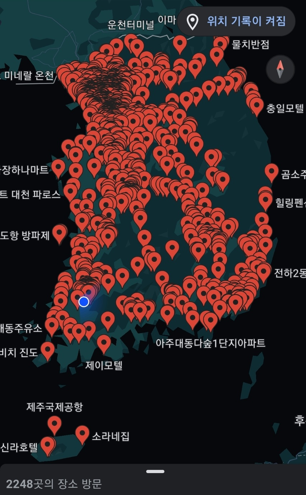
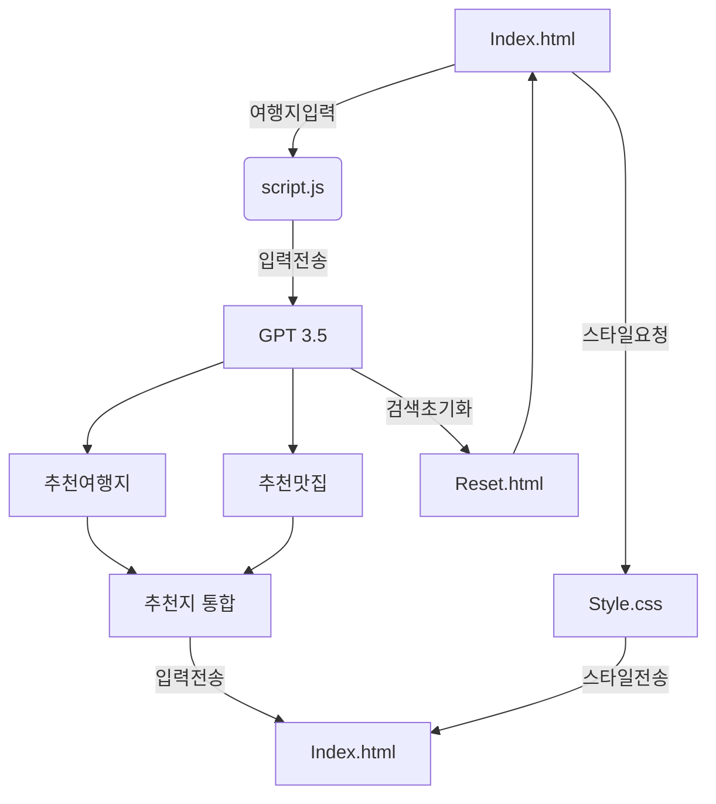
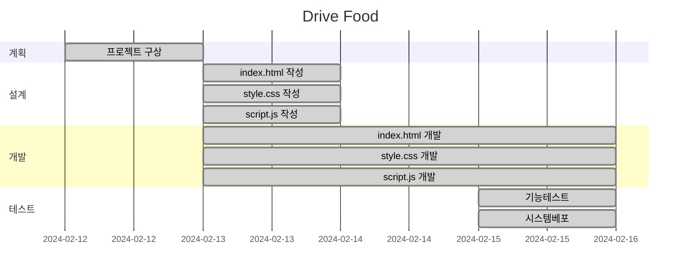
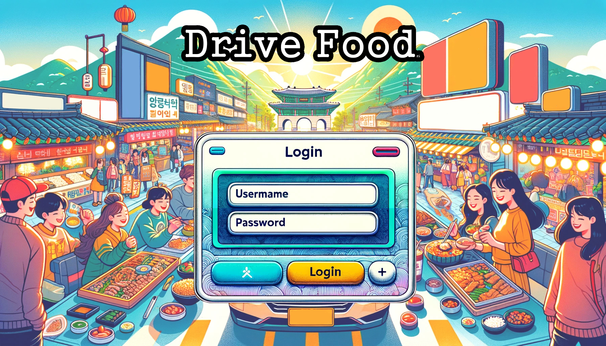
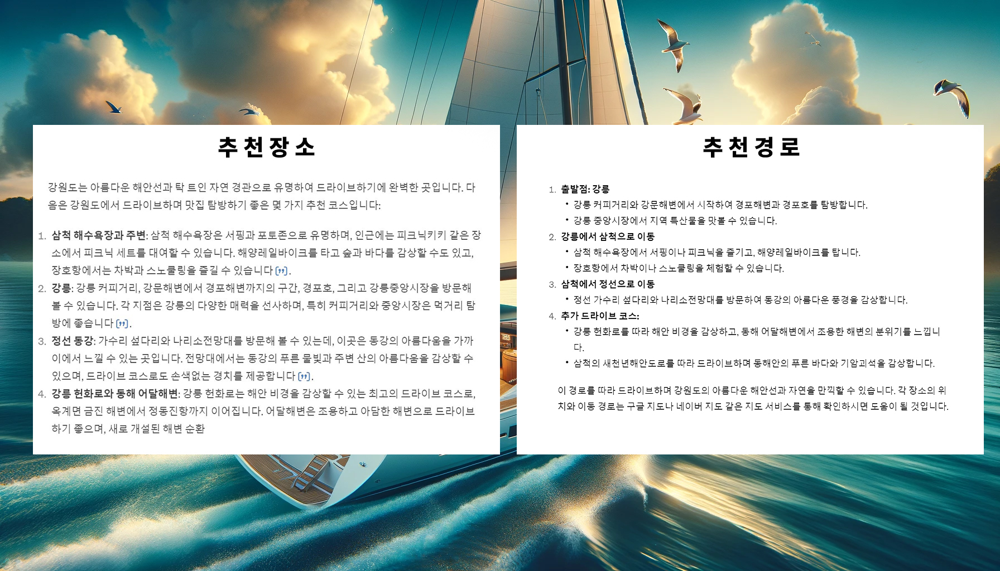

# Drive Food Project

만들고싶었던계기
    <table>
        <tr>
            <th>지도</th>
            <th>설명</th>
        </tr>
        <tr>
            <td width="70%">
                
            </td>
            <td>
                <ul>
                    <li>여행</li>
                    <li>맛집투어</li>                   
                </ul>
            </td>
        </tr>
    </table>

## 목표
- 어디로 여행갈지 정해지지 않고 자유여행을 고민할때 시간감소
- 여행에 대한 고민없이 근처 맛집탐방 및 여행

## 기능

- **드라이브 추천**: GPT-3.5를 통해 입력한 장소의 드라이브 코스 및 관광지, 야경을 추천 받습니다
- **근처 맛집 추천**: 드라이브 코스 근처 맛집을 추천 받습니다.

## 추가기능

- 로그인
- 회원가입
- 아이디 / 비번찾기
- 개인 여행지 등록

## 사용방법
 - Drive Food를 활성화 해주세요.
 - 가고 싶은 여행장소를 입력하시면 OPENAI가 근처 드라이브 코스와 관광지를 가르쳐 줍니다.
 - 추가하고 싶은 장소를 입력해 주시면 같이 검색해 줍니다.

* 서비스 URL 정보
    * 실행 URL: https://junha9694.github.io/GPT_-travel_repoProject1
    * https://github.com/Junha9694/GPT_-travel_repoProject1
    

## 구조

## WBS

## URL 구조
- main

| App       | URL                                        | Views Function    | HTML File Name                        | Note           |
|-----------|--------------------------------------------|-------------------|---------------------------------------|----------------|
| main      | 'home/'                                    | home              | main/home.html                        | 홈화면          |

- accounts

| App       | URL                                       | Views Function    | HTML File Name                       | Note           |
|-----------|-------------------------------------------|-------------------|--------------------------------------|----------------|
| accounts  | 'register/'                               | register          | accounts/register.html               |회원가입         |
| accounts  | 'login/'                                  | login             | accounts/login.html                  |로그인           |
| accounts  | 'logout/'                                 | logout            | accounts/logout.html                 |로그아웃         |
| accounts  | 'profile/'                                | profile           | accounts/profile.html                | 비밀번호변경기능 |

- board

| App       | URL                                        | Views Function    | HTML File Name                        | Note           |
|-----------|--------------------------------------------|-------------------|---------------------------------------|----------------|
| board     | 'reset/'                                   | reset             | boardapp/reset.html                  | 검색 초기화 |
| board     | 'presonal_save /'                          | presonal_save     | boardapp/presonal_save.html          | 개인 저장   |

 화면 정의서 
    <table>
        <tr>
            <th>메인화면</th>
            <th>설명</th>
        </tr>
        <tr>
            <td width="70%">
                
            </td>
            <td>
                <ul>
                    <li>로그인 화면</li>
                    <li>아이디 비번 입력</li>
                    <li>(+)버튼으로 회원가입</li>
                </ul>
            </td>
        </tr>
    </table>
    <table>
        <tr>
            <th>검색창</th>
            <th>설명</th>
        </tr>
        <tr width="70%">
            <td width="70%">
                
            </td>
            <td>
                <ul>
                    <li>검색창</li>
                    <li>가고 싶은 여행지 입력</li>
                </ul>
            </td>
        </tr>
    </table>
    <table>
        <tr>
            <th>그 외 메뉴 화면</th>
            <th>설명</th>
        </tr>
        <tr>
            <td width="70%">
                
            </td>
            <td>
                <ul>
                    <li>HOME버튼:처음 검색 화면</li>
                    <li>초기화버튼:같은장소 다른곳을 추천받음</li>
                    <li>저장버튼:추천받은 장소 저장</li>                 
                </ul>
            </td>
        </tr>
    </table>
        <table>
        <tr>
            <th>검색 후 나오는 화면</th>
            <th>설명</th>
        </tr>
        <tr>
            <td width="70%">
                
            </td>
            <td>
                <ul>
                    <li>검색 결과값</li>
                    <li>추천장소</li>
                    <li>추천경로</li>                 
                </ul>
            </td>
        </tr>
    </table>

